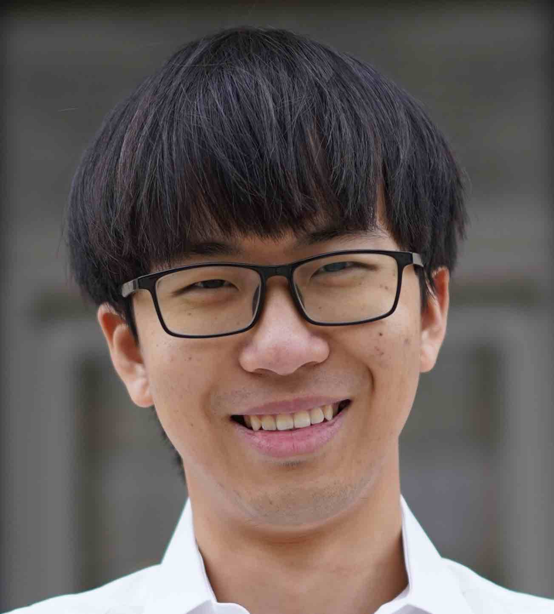

# Computational Stem Cell Biology

<figure>
    
    <figcaption>Level up</figcaption>
</figure>

!!! info "This is a companion website for the class"
    
    **EN 580.447/647    Computational Stem Cell Biology** 
    Spring, 2025 (3 credits, EQ) 
    Please monitor your email and the [Canvas page](https://jhu.instructure.com/courses/90696) for notifications and announcements.

#### Education Team

-   __Patrick Cahan, Ph.D.__ :fontawesome-solid-person-chalkboard:{ .lg } *Course Instructor* { align=right width="75"}

    ---

    Associate Professor of Biomedical Engineering

    patrick [dot] cahan [at] jhmi [dot] edu

    Office hours: Immediately after class on Tues for a quick chat, otherwise email to schedule a time.

    [:octicons-arrow-right-24: Cahan Lab](https://www.cahanlab.org/)

-   __Course email__ :material-email-outline:{ .lg } compscbio@gmail.com
  
    ---

    When emailing the team, **PLEASE** cc compscbio@gmail.com

-   __Orian Stapleton__ :fontawesome-solid-person-chalkboard:{ .lg } *Teaching Assistant* { align=right width="75"}
  
    ---

    Ph.D student in Biomedical Engineering

    ostaple1 [at] jh [dot] edu

    Office hours: Mondays 7:00pm - 8:00pm via [Zoom](https://JHUBlueJays.zoom.us/j/96928725553?pwd=QW7LsYDavmBUXErZ6uUe6wMiwD8i3O.1)

-   __Gary Yang__ :fontawesome-solid-person-chalkboard:{ .lg } *Teaching Assistant* { align=right width="75"}
  
    ---

    Ph.D student in Biomedical Engineering

    garyyang [at] jhu [dot] edu

    Office hours: Wednesdays 7:00pm - 8:00pm in [Brody Atrium](https://maps.app.goo.gl/x1MEcV6Tp2UmEVvDA)

#### Class Meetings
- 12noon to 1:15 PM on Tuesdays and Thursdays
- Shaffer Hall Room 3
- Attendence is encouraged
- Zoom:
    - [https://wse.zoom.us/j/95896765256](https://wse.zoom.us/j/95896765256)
    - Requires authentication via Hopkins SSO to join

#### Course Information
This course teaches students about high-throughput, genome-wide single cell measurements, and approaches to appropriately analyze such data. Real world examples from stem cell biology and developmental biology provide the biological context and motivation, but the computational expertise gained will be broadly applicable. Please see the lecture schedule below for specific topics. By the end of this course, the student should

- be conversant in the language of sc-omics technologies, both at the level of general principles, and more granular understanding of how these data-generating platforms work
- be a confident practitioner in state-of-the art computational methods needed to analyze sc-omic data
- understand the fundamentals of stem cell biology and how sc-omics is allowing us to address major obstacles in this field

#### Recommended Background
- EN.580.151 – Structural Biology of Cells :dna:, or equivalent
- Prior hands on experience coding in Python :simple-python:
- Please see some example homeworks from the [2022 course](https://compscbio.github.io/) to assess your readiness for the class.

#### Course Goals
This course will address the following Criterion 3 Student Outcomes
- An ability to apply knowledge of mathematics, science and engineering to solve problems related to stem cell engineering
- An ability to analyze and interpret data using statistical, computational or mathematical methods
- An ability to function on multidisciplinary teams (Criteria 3(d))
- An understanding of professional and ethical responsibility (Criteria 3(f))
- An ability to communicate effectively (writing) (Criteria 3(g))
- An ability to communicate effectively (oral presentation) (Criteria 3(g))
#### Course Topics
- Stem cell biology
- Single cell omics technologies
- Computational tools for the analysis of single cell omics data

#### Ethics
The strength of the university depends on academic and personal integrity. In this course, you must be honest and truthful. Ethical violations include plagiarism, reuse of assignments, improper use of the Internet and electronic devices, unauthorized collaboration, alteration of graded assignments, forgery and falsification, lying, facilitating academic dishonesty, and unfair competition. In addition, the specific ethics guidelines for this course are:
(1) Homeworks are to be completed by each student alone. Do not share your projects with other students or use material from prior years.
(2) The use of Large language models (LLMs) such as ChatGPT are allowed for the homeworks and final project, when doing so is consistent with the stated Course goals and Course expected outcomes (see above). The use of LLMs and similar technology is not allowed for the weekly written summaries. As a guideline, please use LLMs to augment your understanding of the material in the course, to help you to explore algorithmic ideas that might otherwise be challenging to implement, and more generally, to be a more creative problem solver.
Report any violations you witness to the instructor.  You can find more information about university misconduct policies on the web at these sites:
•   For undergraduates: http://e-catalog.jhu.edu/undergrad-students/student-life-policies/
•   For graduate students: http://e-catalog.jhu.edu/grad-students/graduate-specific-policies/

#### Grades
- **Homeworks: 10% per homework. 50% total**
    - Detailed expectations will be described for each HW
    - Individual work; assistance from LLMs is allowed per guidelines in the Ethics section above.
- **Final project: 50%**
    - Detailed expectations will be described for the project
    - Small teams (3-5 students); assistance from LLMs is allowed per guidelines in the Ethics section above.
    - Entails written and presentation portions
- **In class quizzes: up to 10% extra credit**
    - These will be available via Zoom, too
- Policy on grace periods and extensions: TBA
